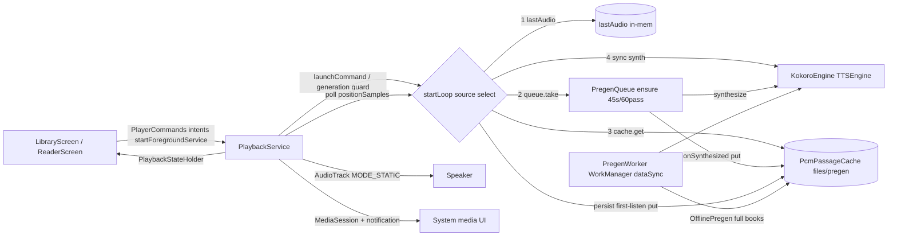

# Generate/Play subsystem overview — local-tts-reader (Ayvu)

Read-only investigation; all claims carry file:line evidence. Paths abbreviated: P = feature-player `src/main/kotlin/com/moronigranja/localttsreader/featureplayer/playback/PlaybackService.kt`, SM = core-player `.../player/PlayerStateMachine.kt`, Q = core-player `.../player/pregen/PregenQueue.kt`, O = core-player `.../player/pregen/OfflinePregen.kt`, PC = core-player `.../player/pregen/PcmPassageCache.kt`, W = feature-player `.../playback/PregenWorker.kt`, M = feature-player `.../playback/PregenManager.kt`, KR = feature-player `.../playback/KokoroRuntime.kt`, PO = feature-player `.../playback/PassageOutput.kt`, E = core-tts `.../tts/Engine.kt`, KE = core-tts `.../tts/kokoro/KokoroEngine.kt`, OS = core-tts `.../tts/kokoro/OrtKokoroSession.kt`, RS = feature-player `.../ui/ReaderScreen.kt`, RV = feature-player `.../ui/ReaderViewModel.kt`.

## 1. Current structure overview

**Note (2026-08-28): the reading-speed selector is removed (decisions #71) —
playback is always 1.0× and stored per-book speeds are ignored on resume. The
speed-model mentions in the body below (e.g. trigger list item 4 "Speed ≠ 1.0 on
demand", the player card pill descriptions) are a historical snapshot of the
retained machinery, kept because the model itself is unchanged.

**End-to-end flow** (passage due → speaker):
1. A transport command arrives as a `startForegroundService` Intent action; `PlaybackService.onStartCommand` enters the foreground FIRST, then dispatches (P:160-186; P:162-163 "startForeground FIRST … never trip ForegroundServiceDidNotStartInTimeException"). The reader side sends intents via `ReaderViewModel.command()` (RV:49-76); the library side goes through `PlayerCommands` → `PlaybackCommandSender` in app (PlayerAdapters.kt:30-57), bound in app.di/AppCoreModule.kt:22-32. There is **no Binder** — `onBind` returns null (P:157); everything is Intent-driven.
2. The command runs as a tracked `commandJob` under a monotonic `commandGeneration` (P:974-1006); each command re-checks `active(generation)` before any side effect (P:1010).
3. The command rebuilds `PlayerStateMachine` over a `BookLayout` from the cached Room parse (`CachedBook.toBook`, CachedBookMapper.kt:18-29), positions it (resume/open/playFrom), and starts the playback coroutine `startLoop()` (P:556-621).
4. `startLoop` sources audio for the passage in priority order: in-memory `lastAudio` (same-passage seek) → `PregenQueue.take` (in-process look-ahead) → `PcmPassageCache.get` (disk tier) → `bufferForPlayback` (synchronous synthesize after an up-to-60 s buffer wait) (P:571-596; log P:598-602).
5. Audio is written as one static buffer into a fresh `AudioTrack` per passage via `AudioTrackPassageOutput` (PO:27-69; MODE_STATIC, speed via `setPlaybackRate` PO:57-61); completion is detected by polling `positionSamples` (P:637-651).
6. `PregenQueue` (built P:863-885) is kept filled by a long-lived `startPrefill` job (P:895-909, re-ensure every 200 ms from the live playhead, ≤60 passages / 45 s — P:1059-1063), which persists every synthesized passage to the shared disk cache through `onSynthesized` (P:877-884).
7. A separate `PregenWorker` (WorkManager, foreground dataSync) runs `OfflinePregen` over whole books into the same `PcmPassageCache` (W:60-127; O:106-173). **The disk cache is the only cross-component coordination point**; both ends write through the same `@Singleton PregenCache` under `files/pregen/` (PregenCache.kt:10-16).
8. The service publishes every change to `PlaybackStateHolder` (singleton StateFlow; PlaybackUiState.kt:17-25) plus MediaSession metadata/state and the media notification (P:677-733), which the reader/library UI observe (RV:24; LibraryViewModel:96-100).

**Communication channels**: Intents (UI→service), in-process StateFlow (service→UI), files (service↔worker↔disk cache), MediaSession/AudioManager broadcast (external media buttons/focus), once-per-command coroutine (internal control).

**Key classes/responsibilities**: `PlaybackService` (player edge: commands, loop, output, MediaSession, focus, notification); `PlayerStateMachine` (pure-JVM transport/sleep/speed/ring, **only** persistence writer — SM:1-30); `PlayerStore` (Room-backed progress+ring+bookmarks contract, PlayerStore.kt:13-36); `PregenQueue` (in-process look-ahead synthesizer); `PcmPassageCache` (disk PCM+sidecar LRU tier); `OfflinePregen` (book-wide planner); `PregenWorker`/`PregenManager` (WorkManager edge/scheduling); `KokoroRuntime` (lazy once-per-process engine host); `KokoroEngine`/`OrtKokoroSession` (TTS impl).

## 2. When does it generate audio?

Triggers, in the order a user meets them:
1. **Open/book load front-load** — `openBook`/`openChapter`/`startPlayback`/`resumePlayer`/`cycleSpeed` all call `startPrefill(position)` (P:220-221, 262-264, 320, 369-371, 487-489): a book opened while idle warms the first ~45 s of audio.
2. **Playback-time prefill** — the long-lived `startPrefill` job re-runs `PregenQueue.ensure(playhead)` every 200 ms while `isActive` (P:895-909). `ensure` walks the spine strictly after the playhead, contiguous, bounded by `lookahead=60` passages and `lookaheadSeconds=45` (Q:61-112; P:875-876, 1059-1061); it breaks early once 45 s are queued (Q:106-109). Order = spine order (book order), not priority-weighted.
3. **Cold/jumped passage synchronous fallback** — `bufferForPlayback` waits up to `PLAY_BUFFER_TIMEOUT_MS=60 s` for the queue to render, then synthesizes synchronously (P:920-945, 1066); a first-listen passage is persisted immediately after playing (P:610-616).
4. **Speed ≠ 1.0 on demand** — cache/progen keys include `speed` (PregenTypes.kt:15-25); pregen runs at 1.0 only (W:75), so 1.25/1.5/2.0 always miss the cache and synthesize on demand (P:572-596).
5. **Manual offline pre-generation (library UI)** — `PregenManager.pregenerate` enqueues a unique one-time `PregenWorker` per book with an optional listening-time budget (M:44-58; LibraryScreen budget dialog 572-595; LibraryViewModel:100-102). `OfflinePregen.run` walks chapters 0..n / passages 0..m in spine order, **skipping already-cached passages** (O:140-143 — the cache is the source of truth, so runs resume anywhere).
6. **Overnight scheduled pre-generation** — `ensureOvernightScheduled` installs a 24 h `PeriodicWorkRequest` with `RequiresCharging` + `RequiresBatteryNotLow` (M:66-79). **Currently DISABLED at app start**: the call was removed per user request (HANDOFF.md:46-56; `LocalTtsReaderApp` has no pregen wiring — LocalTtsReaderApp.kt:35-43 only rebuilds the index). A pre-existing leftover scheduled job may still fire once (HANDOFF.md:57-62).
7. **Post-STOP fill** — after `ACTION_STOP`, the service keeps synthesizing from the stopped playhead until 45 s ahead is queued or 120 s elapse, persisting to disk for the next open (P:520-531, 955-968, 1067-1068).

Priorities: there is **no priority scheme**; the only arbitration is that overnight pregen *yields* to playback (`shouldContinue = mode != overnight || !PlaybackActive.isActive`, W:152-160; PlaybackActive boolean set by the service, P:326, 521), while **manual pregen intentionally does NOT yield** and can run concurrently with playback in the same process (same singleton engine).

## 3. When does it stop?

**Generation halts:**
- Prefill/queue: `stopEverything()` cancels `pregenJob` (P:988-990); pause, navigation, seek, speed change, book switch all stop or rebuild (P:375-494); post-stop fill self-stops via `stopSelf()` (P:961-967); queue prunes entries at/before the playhead on every ensure (Q:63-64).
- OfflinePregen (O:106-173): budget exhaustion — `maxPassages`/`maxChapters`/`maxTimeMs` (O:131-135); **cache saturation** — `bytesRemaining()==0` gate before any put, plus the last-put-size gate (O:145-149; PC:110); **yield** — `shouldContinue()` false (O:127, 137); **`SynthesisOutcome.Unavailable`** stops immediately (O:158-159) and **5 consecutive failures** stop the run (O:161-163, cap O:22); coroutine cancellation (WorkManager cancel / process kill) via `ensureActive` per passage (O:124, 130). WorkManager cancel: `PregenManager.cancel` (M:61-63); `PregenStorage.deleteBook` cancels first, then deletes the subtree (PregenStorage.kt:42-44).
- **Cache eviction does NOT stop generation** — playback puts simply evict LRU entries on a shared 4 GiB cap (PC:81-94, 142-153, 198); only `OfflinePregen` gates on free space.
- Engine restart: **there is no restart path** — `KokoroRuntime.engine()` opens once, caches the engine or a permanent `failure` string; a failed open is terminal for the process (KR:23-59). The engine is never closed in production (KokoroEngine.close exists, KE:150-152, but nothing calls it).

**Playback halts:**
- `stopEverything()` — supersedes the generation, cancels the command/loop/ticker/prefill jobs, completes `stopSignal`, stops the output (pause+flush+release AudioTrack) and abandons audio focus (P:974-999). Used by every control command before its own action (pause P:379, navigate P:390, seek P:421, speed P:475, stop P:524-525, focus pause P:779-784).
- Natural passage end: `awaitPlaybackOrStop` returns true at `totalFrames - 240` (10 ms margin @24 kHz, P:640, 1056) → `onPassageFinished` advances or completes (SM:217-249); completion settles phase COMPLETED and the loop returns (P:616-622).
- Sleep timer: `EndOfChapter` stops at a chapter boundary inside `onPassageFinished` (SM:222-232); `Duration` fires from the 1 s ticker → `advance()` → `PauseRequested` (P:661-674; SM:307-330).
- Focus loss/noisy: `pausePlayer(FOCUS/NOSY)` (P:768-794); becoming-noisy on headset unplug (P:792-795).
- App killed: `onDestroy` performs exactly one authoritative final write via `teardownWrite` — joins the graceful stop's write or captures the live playhead itself (CR-2, P:1012-1042); **abrupt process death** loses at most one 5 s checkpoint interval (`dueCheckpoint` gate P:653-659; checkpoints written in the play loop P:648).
- Screen off: no explicit handling and **no wakelock anywhere** (no PowerManager/WakeLock/FLAG_KEEP_SCREEN_ON matches in feature-player); audio continues because the service is foreground. CPU-deep-sleep behavior of the 50 ms poll loop is unhandled [INFERENCE].
- Errors: synthesis failure publishes `failure` into the UI state (P:294-295, P:603-605, P:632-634); disk misses just fall back to synthesis (P:590-596).

## 4. What happens during playback?

- **Single-writer player commands** (CR-5/CR-7, P:113-131, 974-1010): every control-plane command (open/openChapter/play/resume/pause/navigate/seek/undo/speed/stop) runs as one tracked `commandJob` under a monotonic `commandGeneration`. `stopEverything()` bumps the generation FIRST, then cancels; a superseded command re-checks `active(generation)` before ANY `publish()`/`startForeground`/`stopForeground`/`startLoop` side effect. What it protects: a stale load cannot publish state or drop the foreground after a newer command won (CR-5, open-bugs.md:372-446), and pause during `LOADING` cannot be overwritten by the finishing loop's `PLAYING` publish (CR-7, open-bugs.md:537-605).
- **Queueing**: rapid taps serialize on `commandLock` (Mutex) inside seek/skip/undo/speed bodies (P:392-405, 423-436, 477-490), and the generation check orders overlapping commands. The playback loop itself runs inside its command job.
- **Source tiers & streaming**: per passage, `lastAudio` (same-passage seek replay with zero synthesis — decisions #55 layer 1, P:605-609) → `PregenQueue.take` (P:577-578; lock-free consume Q:117-118) → `PcmPassageCache.get` (P:579-580, 587-589) → synchronous `bufferForPlayback` (P:581-583). In-flight first-listen writes are joined before re-fetch so a seek always finds the disk entry (P:573-575, 610-616).
- **Gapless/continuity**: each passage is a static `AudioTrack`; the boundary is `output.play(...)` → `awaitPlaybackOrStop` → `onPassageFinished` → loop re-entry; measured device gap ~20 ms with `source=pregen` (HANDOFF.md:37-41) because the next passage is already rendered. There is no cross-fade and no silence detection.
- **MediaSession**: one `MediaSessionCompat`, state mapped from `PlayerPhase` (PLAYING/LOADING→STATE_PLAYING, PAUSED, COMPLETED→STOPPED, IDLE→NONE), actions play/pause/skip-prev/skip-next/stop, title metadata (P:704-730); callbacks `onPlay/onPause/onStop/onSkipToNext/onSkipToPrevious` (P:746-751). Session created in `onCreate` (P:141-147).
- **Notification**: media style, ongoing, actions Previous / Play-Pause / Next / Stop, content intent opens MainActivity, cover art from `files/covers/<bookId>` (P:798-854); `setShowActionsInCompactView(1)` (P:849). Re-notified on every `publish()` (P:732).
- **Audio output**: one `AudioTrack` at a time, MODE_STATIC, mono 16-bit PCM at the engine's reported rate, speed via `setPlaybackRate` so buffer frames stay book-time at any speed (PO:27-69; P:1076-1094; decisions #52). Completion by polling, not markers (PO:15-18, 63-64).

## 5. Lifecycle coverage matrix

| Scenario | What the code does | Status |
|---|---|---|---|
| App foreground, reading | `openBook` positions the machine, publishes text state, drops foreground, warms ~45 s prefill (P:196-232) — **no auto-play** (decisions #52). Reader pages are visual only; playback only starts from transport/play. | Works |
| Screen off | Foreground service continues; AudioTrack keeps playing; no wakelock, no screen-off handling; poll loop may stall in deep sleep without audio activity [INFERENCE]. | Implicit/unhandled |
| Playback from notification action | Notification actions are `PendingIntent.getService` with `ACTION_RESUME/PAUSE/SKIP_*/STOP` (P:798-854). With the service alive, works — but the action intents carry **no book id** (P:805-809). If the process died, `resumePlayer(bookId=null)` finds `machine==null` and `bookId==null` → returns — dead no-op (P:334-342). | **Broken after process death** |
| MediaSession button (headset/BT) | `onPlay` → `resumePlayer()`; same machine-less dead path after process death; otherwise works (P:746-751). Becoming-noisy pauses on unplug (P:792-795). | Partly broken (post-death) |
| Play button on library screen | `LibraryViewModel.playBook` → `PlayerCommands.play` → `PlaybackCommandSender` → `ACTION_PLAY` with book id (LibraryViewModel:90-97; PlayerAdapters.kt:37-41) → `startPlayback` builds the machine, resumes from stored progress (P:281-332). Works even after process death because the book id is carried. | Works |
| Play button on the open-book screen | Shared `PlayerCard` bottom bar; `playing → commands.pause() else commands.resume()` (core-ui/PlayerCard.kt:170-183); `ReaderViewModel.resume()` carries `openedBookId` — so the machine-less rebuild fallback DOES work here (RV:27-31, 50; P:334-342). | Works |

Untested on device: the post-death notification/media-button path (no instrumented test covers process death + notification action; PregenE2eTest/PlaybackE2eTest drive in-process flows).

## 6. Passage changes

The **only natural advance trigger is audio completion via polling**: `awaitPlaybackOrStop` polls `output.positionSamples >= totalFrames - 240` every 50 ms (P:637-651) — no marker callback, no silence detection, no timer. On completion the loop calls `PlayerStateMachine.onPassageFinished()` (P:616-622), which advances spine order, clears sleep-timer EndOfChapter at chapter boundaries, or completes the book at the end (SM:217-249); logic lives in **core-player (PlayerStateMachine)**. Manual changes: skip forward/back (P:386-414 → `skipForward`/`skipBackward` SM:256-264), ±30 s rolling seek mapped via chars/sec (P:417-466; SM:278-291; BookProgress.positionAt BookProgress.kt:120-151), play-at-passage (tap = S3 "Listen here", chapter menu, bookmark jump, share intent — RS:384-395, 154-166; RV:33-44), undo ring (SM:292-302), sleep-timer pauses (SM:222-232, 307-330). **Reader page swipes/taps do NOT move the playhead** — they flip local page state and only cross chapters via `openChapter` (positions without playing, P:234-276; RS:373-383); playback instead turns the reader's page via `LaunchedEffect` on `passageIndex` (RS:306-313).

## 7. Kokoro coupling inventory (generate/play path)

Layers that know **kokoro specifically**:
- `KokoroRuntime` (KR:23-59) — hardcodes `KokoroPacks.all`, staged `espeak/libespeak-ng.so` + `espeak-ng-data` paths, `DefaultEngines.kokoro`; the class itself is named Kokoro and is `@Singleton`-injected directly into `PlaybackService` and `PregenWorker` (P:56-59; W:47-58).
- Sample-rate assumption **24 000 Hz**: `liveOffsetSeconds()` divides by `KokoroEngine.SAMPLE_RATE` (P:736-743); `FRAME_MARGIN = 240 // 10 ms at 24 kHz` (P:1056); `PregenSpaceEstimator.BYTES_PER_SECOND = KokoroEngine.SAMPLE_RATE * 2` (core-player PregenSpaceEstimator.kt:52) — a kokoro import in **core-player**. `sliceForSpeed` is rate-agnostic (uses the audio's own rate, P:1086-1091).
- Cache key: `PregenKey` = bookId/voice/speed only — **no engine dimension** (PregenTypes.kt:15-25); voice strings are kokoro voice names (`SettingsStore.DEFAULT_VOICE = "af_heart"`, SettingsStore.kt:62). decisions.md:614-619 plans an engine dimension for CosyVoice (not implemented).
- Settings: `PackRegistry` over `DefaultEngines.descriptors` (kokoro + metadata-only cosyvoice3, DefaultEngines.kt:30-36); SettingsScreen filters rows by hardcoded pack ids `kokoro-model`/`kokoro-voices`/`espeak-ng` (SettingsScreen.kt:88); `VoiceCatalog` parses the kokoro voices npz via `KokoroVoiceBank` (VoiceCatalog.kt:28-32); `EspeakStager` stages the espeak pack (core-player EspeakStager.kt:16-76).
- Gradle: `onnxruntime-android` AAR + JNA `@aar` in app (app/build.gradle.kts:79-87); core-tts compiles against the ORT Java API `compileOnly` (core-tts/build.gradle.kts:24-27).
- Test pins: `PregenE2eTest` asserts `KokoroEngine.SAMPLE_RATE` (PregenE2eTest.kt:164).

Layers that know only the **generic `TTSEngine`** contract: `PlaybackService` synthesis call sites (P:872-874, 944), `PregenQueue` (Q:22-30, 104), `OfflinePregen` (O:19-23), `PregenWorker` (W:81-84, 137-138). Read-along highlight depends on `SynthesisOutcome.Audio.segments`, which kokoro produces from timings and other engines may leave null (E:84-89; KE:138-147; decisions #31).

**Abstractions that exist**: `TTSEngine` interface (E:54-63); `SynthesisRequest`/`SynthesisOutcome` (E:65-95); `KokoroSession` internal inference seam with `OrtKokoroSession` as the ORT impl (KokoroSession.kt:13-30; OS:28-34); `OrtKokoroSession.open(..., sessionFactory = {})` additive ORT-provider seam (OS:96-100; decisions #67 D2); `KokoroRuntime.engine(): TTSEngine?` host-test seam (KR:30; tests override it — PlaybackServiceA57Test.kt:97-100, PregenWorkerTest.kt:99-101); app.di composition for the player contracts (AppCoreModule.kt:22-32).

## 8. Engine replaceability

Already swappable behind the seams, with four concrete friction points:
1. **New engine impl** — implement `TTSEngine.synthesize` → `SynthesisOutcome.Audio(pcm, sampleRateHz, channelCount=1, segments=null)` (E:78-95). Piper: model+config packs + shared espeak-ing phonemizer; cloud: needs a network transport and its own Unavailable/Failed semantics (already typed, E:93-94). The pack machinery (`PackRegistry`/`PackDownloader`/`PackCache`, decisions #7/#23) is engine-agnostic.
2. **Engine-production seam** — `KokoroRuntime` must become a generic `EngineRuntime` (rename + spec selection from settings); today the name, packs, espeak paths and failure semantics are kokoro-bound (KR:23-59). It returns `TTSEngine?` already, so both service and worker are insulated.
3. **24 kHz hardcoding** — fix `PlaybackService.liveOffsetSeconds` (P:736-743) and `FRAME_MARGIN` (P:1056) to use the last rendered audio's `sampleRateHz`, and `PregenSpaceEstimator` (PregenSpaceEstimator.kt:52) to a per-engine rate table. Without this, a 22.05 kHz (piper) or 16 kHz (cloud) engine silently miscomputes the live playhead and the 10 ms completion margin.
4. **Cache-key engine dimension** — add `engine` to `PregenKey` and the path layout (`<root>/<bookId>/<voice>/<speed>/…` today, PC:11-22; PregenTypes.kt:15-25), parsing legacy paths as `kokoro` (already planned, decisions.md:614-619); otherwise a second engine with the same voice name collides on the same PCM file.

Plus cosmetic/genuine work: `VoiceCatalog` npz parsing is kokoro-specific (VoiceCatalog.kt:28-32); SettingsScreen hardcodes kokoro pack ids (SettingsScreen.kt:88); speed semantics are kokoro graph inputs (`SynthesisRequest.speed`, E:71-75; the player already treats speed engine-side, P:1076-1094). Read-along segments degrade to no-highlight on segment-less engines by contract (E:84-89). **Effort: small-to-moderate** for the seams (items 2-4 ≈ a focused slice), with the engine implementation itself the bulk; nothing in the player/pregen core needs to change (all generic).

## 9. Parallel runs

**Current concurrency model**: there are **no `android:process` attributes anywhere** — WorkManager's `PregenWorker` and `PlaybackService` both run in the single app process and share the **same `@Singleton` engine** (`KokoroRuntime`, KR:23-27). So today up to **two concurrent synthesis streams can exist**: (a) the service's prefill job (`PregenQueue.ensure`, one long-lived coroutine, single-flight in-process via `inFlight`+lock — Q:66-69, 78-80, 111-113) plus (b) a manual `PregenWorker` `OfflinePregen` loop (manual mode does **not** yield to playback — W:152-160; only overnight does). Within each stream synthesis is sequential. Serialization points: `EspeakPhonemizer` ReentrantLock (espeak global state, EspeakPhonemizer.kt:42, 72-74); ORT session declared thread-safe by the engine docs (OS:22-26) but `infer` has no lock — two streams interleave `session.run` calls on one session; the cache serializes in-process on one `Object` lock with tmp+rename atomic writes (PC:27, 81-94) and bootstraps LRU order from mtime on reopen (CR-4, PC:51-75). The single-writer invariant is *per-session control plane*, not cross-stream synthesis.

Constraints: one engine (RTF headroom budget: Kokoro RTF 0.66-0.76 on S22, hard-facts; PLAY_BUFFER 60 s fallback assumes RTF < 1 — P:916-918); one `PlaybackActive` boolean (PlaybackActive.kt:9-19 — not a refcount); one MediaSession + one notification id 42 (P:1052); one resume row per book in `PlayerStore` (single-writer machine, SM:9-30). The cache's 4 GiB LRU cap is shared by both streams (HANDOFF.md:93-96).

**What N parallel generation/playback runs would need**:
- Generation (N synthetic runs): the engine is the bottleneck — concurrent synthesis is CPU-contended and currently relies on ORT thread-safety with no admission control; N streams need either a synthesis mutex/one-session-per-stream or an accepted RTF degradation. The cache and queue are already thread-safe/reusable per run (one `PregenQueue` per run; `OfflinePregen` per book). This part is *cheap structurally* (planner + queue + cache are per-run objects) — the hard constraint is CPU/RTF, not locking.
- Playback (N sessions): breaks on the singletons — `PlaybackStateHolder`/`PlaybackUiState` (single StateFlow, PlaybackUiState.kt:17-25), one MediaSession/notification (P:141-147, 1052), one `AudioTrack` output (PO:27-69), one machine per book fighting over the same `PlayerStore` resume row and undo ring (SM:1-30), binary `PlaybackActive`, and the per-service `commandGeneration` model. Needs: per-run machines + loops + outputs, a session-keyed command/state model, refcounted `PlaybackActive`, and a decision on shared resume rows. **Sizing: days, not hours — and largely counter-productive on the S22-class CPU**, where one synthesis stream at RTF<1 already fills the budget; the current two-process model exists precisely to keep the engine single and the cache as the only shared state.

## Riskiest couplings (in rank order)
1. **`PlaybackService.publish()` copy-block regressions** — CR-8/CR-9 were collateral drops inside the `it.copy(...)` block (open-bugs.md:26-27, 607-678); every field (`segments`, `offsetSeconds`, `chapterPassages`, `activeSentenceIndex`) must be re-checked on any edit (P:677-733).
2. **24 kHz constant assumption** in `liveOffsetSeconds`/`FRAME_MARGIN` (P:736-743, 1056) + core-player `PregenSpaceEstimator` (PregenSpaceEstimator.kt:52) — silently wrong for any non-kokoro engine; also used as the book-time frame basis for checkpoints and seeks.
3. **Cache key without engine dimension** (PregenTypes.kt:15-25) — cross-engine PCM collisions; path layout is also the delete/usage unit (PC:11-22, 121-124).
4. **One engine, no admission control, permanent-failure latch** (KR:23-59) — worker and service can synthesize concurrently on one session; a failed open never retries.
5. **Post-death control dead-end** — notification/MediaSession actions carry no book id, so a machine-less service cannot resume (P:334-342, 798-854); only UI-initiated commands carry the id.
6. **PlaybackActive is a non-refcounted boolean** (PlaybackActive.kt:9-19) — any second playback surface would need it reworked; overnight yield depends on the service correctly pairing markStarted/markStopped (P:326, 520-521, 1013).
7. **CR-2 capture-vs-teardown ordering** (P:543-550, 1026-1042) — capture `liveOffsetSeconds` before releasing `PassageOutput`, exactly one final write, 5 s checkpoint gate (P:653-659); regressions here silently rewind persisted progress.

## Evidence list (file:line)
- P:160-186 onStartCommand/foreground-first/dispatch; P:196-232 openBook; P:234-276 openChapter; P:281-332 startPlayback; P:334-342 resumePlayer dead path; P:375-384 pausePlayer; P:386-414 navigate; P:417-466 seekBy; P:470-494 cycleSpeed; P:497-509 cycleSleepTimer; P:520-531 stopPlayer; P:543-550 captureAndStop; P:556-621 startLoop; P:610-616 persist; P:637-651 awaitPlaybackOrStop; P:653-659 dueCheckpoint; P:661-674 ticker; P:677-733 publish; P:736-743 liveOffsetSeconds; P:746-751 mediaCallback; P:754-789 focus; P:792-795 noisy; P:798-854 notification; P:863-885 buildQueue; P:895-909 startPrefill; P:920-945 bufferForPlayback; P:955-968 startPostStopPrefill; P:974-999 stopEverything; P:1004-1010 launchCommand/active; P:1012-1042 onDestroy/teardownWrite; P:1053-1070 constants; P:1076-1094 sliceForSpeed.
- SM:119-131 resume; SM:166-174 playFrom ring; SM:177-183 notePlaybackOffset; SM:186-196 pause/onAudioStarted; SM:199-206 stop; SM:217-249 onPassageFinished; SM:307-330 advance; SM:339-341 commitMove.
- Q:61-112 ensure; Q:117-118 take; Q:63-64 prune.
- PC:23-24 ctor; PC:51-75 bootstrap (CR-4); PC:81-94 put; PC:96-107 get; PC:110 bytesRemaining; PC:142-153 evictLocked; PC:198 default cap.
- O:20-32 budget; O:34-51 progress; O:53-70 terminal; O:106-173 run (127/131-135/140-149/158-163/171).
- W:60-127 doWork; W:131-201 runBooks; W:152-160 yield; W:268/270 budgets; W:245-246 modes.
- M:44-58 pregenerate; M:61-63 cancel; M:66-79 overnight schedule; M:82-83 workInfo.
- KR:23-59 engine; KR:61-62 failureReason. PO:13-69 output. KE:42-49 class; KE:56-148 synthesize; KE:155 rate; KE:184-209 open+sessionFactory. OS:38-71 infer; OS:96-137 open; OS:22-26 thread-safety note. E:54-95 contracts.
- RS:306-313 page follow; RS:353-397 gestures; RS:384-395 middle tap; RS:434-447 sentenceSpans. RV:49-76 intents.
- PlayerAdapters.kt:30-57/63-100; AppCoreModule.kt:22-32; PregenTypes.kt:15-25 key; PregenSpaceEstimator.kt:52; PlaybackActive.kt:9-19; EspeakPhonemizer.kt:42,72-74; SettingsStore.kt:62; LocalTtsReaderApp.kt:35-43 + HANDOFF.md:46-56 (overnight disabled); app/feature-player manifests (no android:process; PlaybackService fgsType mediaPlayback; worker SystemForegroundService dataSync).